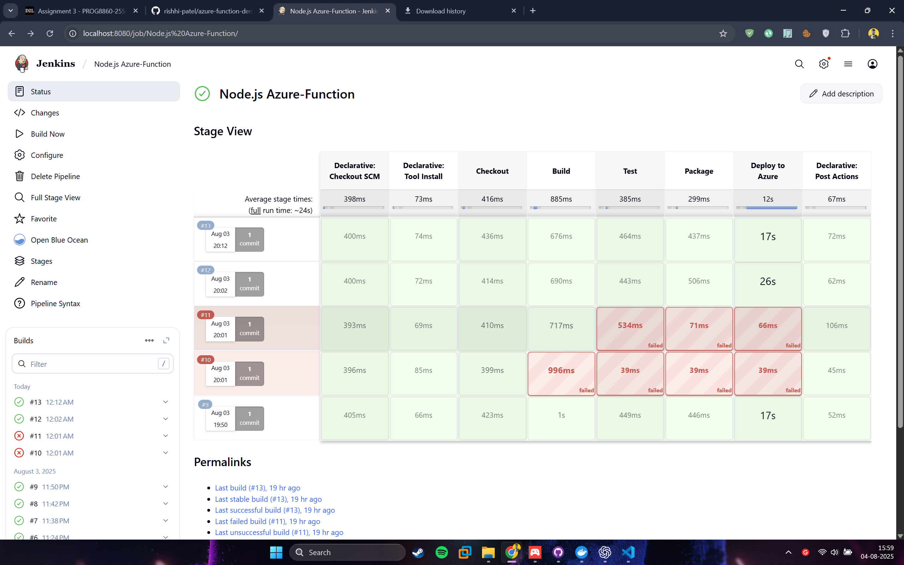
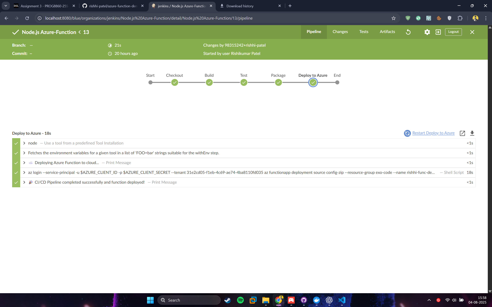
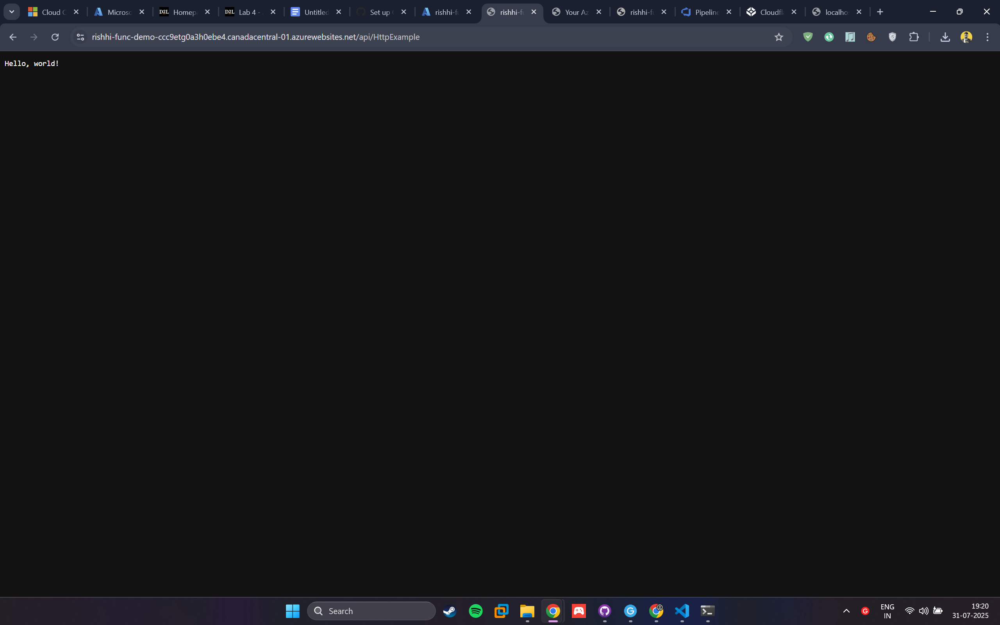

# Jenkins Deployment for Azure Functions

This README provides instructions for deploying an **Azure Function App** using **Jenkins**.
It is a conversion of your Azure DevOps pipeline to a Jenkins pipeline.

---

## 1️⃣ Prerequisites

1. **Jenkins Installed** with the following plugins:
   - Pipeline
   - Credentials Binding
2. **Azure CLI Installed** on the Jenkins agent
3. **Node.js 20.x** installed (or install via pipeline step)
4. **Azure Service Principal** created with access to your Function App.

---

## 2️⃣ Jenkinsfile Example

```groovy
pipeline {
    agent any

    environment {
        FUNCTION_APP_NAME = 'rishhi-func-demo'
        RESOURCE_GROUP = 'exo-code'
        TENANT_ID = '31e2cd05-f1eb-4c69-ae74-4ba8110fd035'
    }

    tools {
        nodejs 'node'
    }

    stages {

        stage('Checkout') {
            steps {
                echo 'Fetching code from GitHub...'
                checkout scm
            }
        }

        stage('Build') {
            steps {
                script {
                    echo '📦 Installing Node.js dependencies...'
                    sh 'npm install'
                }
            }
        }

        stage('Test') {
            steps {
                script {
                    echo '🧪 Running tests...'
                    sh 'npm test'
                }
            }
        }

        stage('Package') {
            steps {
                script {
                    echo '📁 Zipping function for deployment...'
                    sh '''
                        rm -f function.zip
                        zip -r function.zip host.json package.json package-lock.json src -x "*.git*" "*node_modules*" "*.vscode*" "*@tmp*" "*.DS_Store"
                    '''
                }
            }
        }

        stage('Deploy to Azure') {
            steps {
                script {
                    echo '☁️ Deploying Azure Function to cloud...'
                    withCredentials([usernamePassword(credentialsId: 'Azure-rishhi.dev',
                                                     usernameVariable: 'AZURE_CLIENT_ID',
                                                     passwordVariable: 'AZURE_CLIENT_SECRET')]) {
                        sh '''
                            az login --service-principal \
                              -u $AZURE_CLIENT_ID \
                              -p $AZURE_CLIENT_SECRET \
                              --tenant 31e2cd05-f1eb-4c69-ae74-4ba8110fd035

                            az functionapp deployment source config-zip \
                              --resource-group exo-code \
                              --name rishhi-func-demo \
                              --src function.zip
                        '''
                    }
                }
            }
        }
    }

    post {
        success {
            echo '🎉 CI/CD Pipeline completed successfully and function deployed!'
        }
        failure {
            echo '❌ Pipeline failed. Check the logs for errors.'
        }
    }
}

```

---

## 3️⃣ Steps to Deploy

1. Create a new **Jenkins Pipeline job**.
2. Paste the Jenkinsfile above in your repository.
3. Configure Jenkins credentials for Azure.
4. Run the pipeline → It will:
   1. Install Node.js
   2. Install dependencies
   3. Prepare deployment files
   4. Zip and deploy to Azure Functions

## 6. Result

- **Function URL:** https://rishhi-func-demo-ccc9etg0a3h0ebe4.canadacentral-01.azurewebsites.net/api/HttpExample

  1. Jenkins
     
     adme/1754159880232.png)

  2. Browser screenshot of function output
     
