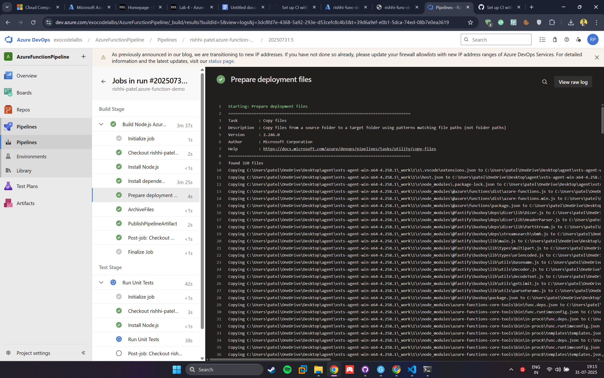
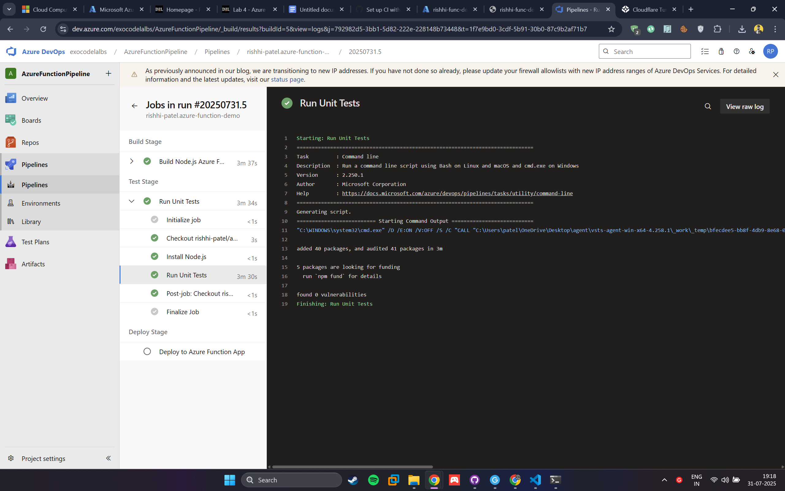
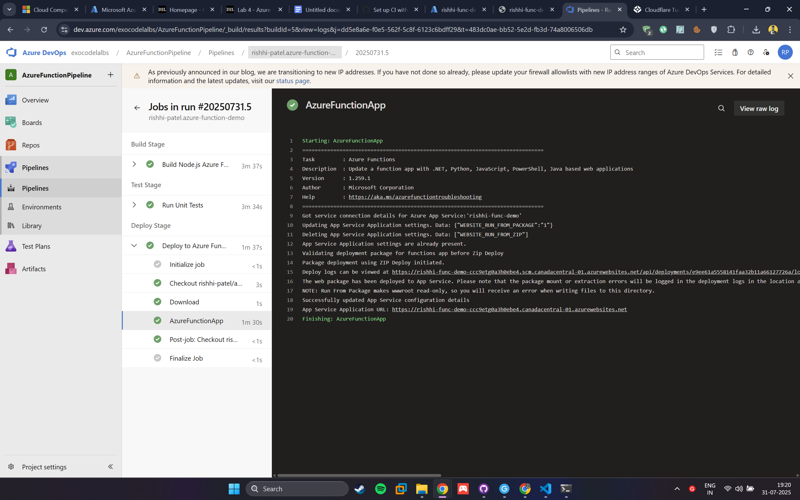

# Azure DevOps CI/CD Pipeline for Node.js Azure Function

This README documents the step-by-step process of setting up a **CI/CD pipeline** in **Azure DevOps** for a **Node.js Azure Function App**.

---

## 1. Project Overview

We create a simple **HTTP-triggered Azure Function** that returns `"Hello, world!"` and deploy it using a **3-stage pipeline**:

1. **Build Stage** – Install dependencies and package the function.
2. **Test Stage** – Run unit tests.
3. **Deploy Stage** – Deploy the function to **Azure Function App**.

---

## 2. Repository Structure

```
Azure-function-Demo/
 ├── src/functions/HttpExample.js
 ├── package.json
 ├── azure-pipelines.yml
```

---

## 3. Azure DevOps Pipeline Configuration

### 3.1 Build Stage (CI)

- Install Node.js 20.x
- Run `npm install` and `npm run build`
- Archive and publish build artifacts

```yaml
stages:
  - stage: Build
    displayName: "Build Stage"
    jobs:
      - job: Build
        pool:
          vmImage: windows-latest
        steps:
          - task: NodeTool@0
            inputs:
              versionSpec: "20.x"
          - script: |
              npm install
              npm run build
          - task: ArchiveFiles@2
            inputs:
              rootFolderOrFile: "$(System.DefaultWorkingDirectory)"
              archiveType: zip
              archiveFile: "$(Build.ArtifactStagingDirectory)/functionapp.zip"
              replaceExistingArchive: true
          - publish: "$(Build.ArtifactStagingDirectory)/functionapp.zip"
            artifact: drop
```

### 3.2 Test Stage

- Install dependencies
- Run `npm test`

```yaml
- stage: Test
  displayName: "Test Stage"
  dependsOn: Build
  jobs:
    - job: Test
      pool:
        vmImage: windows-latest
      steps:
        - task: NodeTool@0
          inputs:
            versionSpec: "20.x"
        - script: |
            npm install
            npm test
```

### 3.3 Deploy Stage

- Download build artifact
- Deploy to **Azure Function App** using **Service Connection**

```yaml
- stage: Deploy
  displayName: "Deploy Stage"
  dependsOn: Test
  jobs:
    - job: Deploy
      pool:
        vmImage: windows-latest
      steps:
        - download: current
          artifact: drop
        - task: AzureFunctionApp@1
          inputs:
            azureSubscription: "exo-service-connection"
            appType: "functionApp"
            appName: "rishhi-func-demo"
            package: "$(Pipeline.Workspace)/drop/functionapp.zip"
```

---

## 4. Triggering the Pipeline

1. Commit and push changes to `main` branch.
2. Pipeline triggers automatically.
3. Verify logs for **Build → Test → Deploy** stages.

---

## 5. Verifying Deployment

1. Go to **Azure Portal** → **Function App** → Copy function URL.
2. Open in browser or Postman → Should return:

```
Hello, world!
```

---

## 6. Result

- **Function URL:** https://rishhi-func-demo-ccc9etg0a3h0ebe4.canadacentral-01.azurewebsites.net/api/HttpExample
  
- **Screenshots:**

  1. Build Stage Success
     
  2. Test Stage Success
     

  3. Deploy Stage Success
     
  4. Browser screenshot of function output
     

---

**Author:** Rishikumar Patel (8972657)
